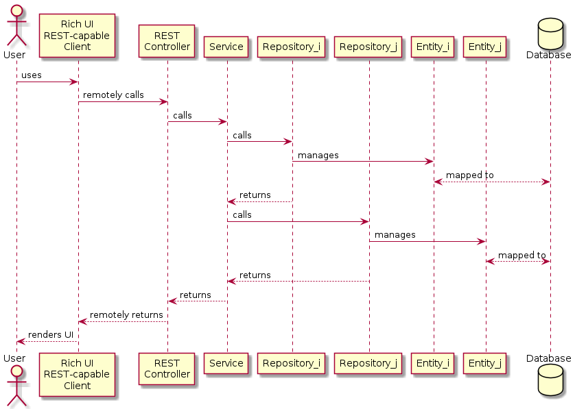

# XCommerce SOA Monolithic - Spring Boot
This is the server-side of the enterprise-class XCommerce application based on a monolithic-mvc-soa architecture. It is written in Java and leverages Spring Boot as a highly productive, opinionated enterprise application development and production environment. Spring Boot orchestrates several technologies powering XCommerce Monolithic, namely JPA, Hibernare, PostgreSQL, Redis, REST and JWT.

This is part of the overarching [XCommerce](https://github.com/oiraqi/xcommerce) project. Other sibiling sub-projects are:
- [XCommerce Standalone (C)](https://github.com/oiraqi/xcommerce-standalone-c)
- [XCommerce Cloud Microservices (Spring Cloud)](https://github.com/oiraqi/xcommerce-microservices)
- [XCommerce PWA (Angular)](https://github.com/oiraqi/xcommerce-client-angular)

**You're welcome to contribute through your favourite monolithic or microservices back-end technology and/or front-end technology!**
## Requirements
### Functional Requirements
### Non-functional Requirements
- **Performance**
  - Response time shall not exceed 200 ms
- **Scalability**
  - The system shall scale *out* to preserve performance even when the load grows, at a reasonable cost
- **Security**
  - The confidentiality and integrity of all data traffic shall be protected
  - The authenticity of both the client and the server shall be ensured
  - User access shall be restricted to own account, orders and history
  - Service high availability shall be ensured, i.e., single points of failure shall be avoided

## Architecture

## Design
### Class Diagrams
- **Entity Class Diagram**

  

- **Repositories and Services Class Diagram**

  

### Sequence Diagrams
- **Data-driven Sequence Diagram**

  

- **Service-driven Sequence Diagram**

  

## Development
**Starting point**
- Clone this repository
- cd final
- ./gradlew build
- There you go!

**You need to install Docker, then run these commands**
- docker pull redis
- docker pull postgres
- docker run --name redis-container -p 6379:6379 -d redis
- docker run --name postgres-container -e POSTGRES_PASSWORD=postgres -p 5432:5432 -d postgres
- docker exec -it postgres-container psql -U postgres
- create database xcommerce
