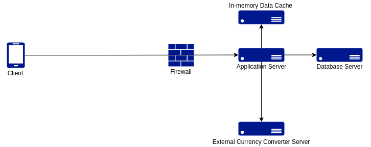
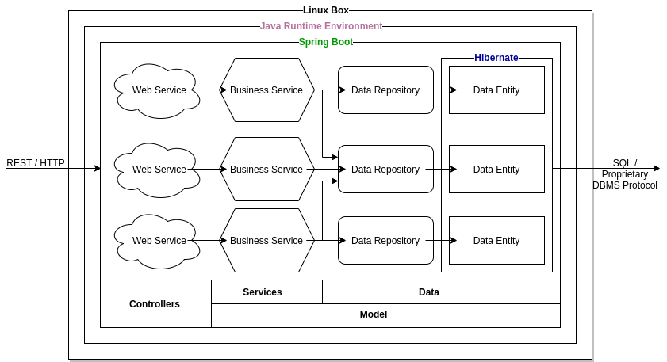
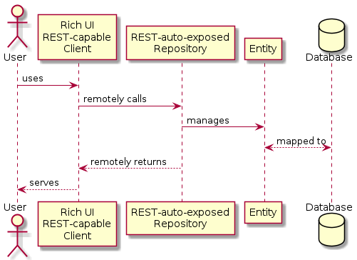

# XCommerce SOA Monolithic - Spring Boot
This is the server-side of the enterprise-class XCommerce application based on a monolithic-mvc-soa architecture. It is written in Java and leverages Spring Boot as a highly productive, opinionated enterprise application development and production environment. Spring Boot orchestrates several technologies powering XCommerce Monolithic, namely JPA, Hibernare, PostgreSQL, Redis, REST and JWT.

This is part of the overarching [XCommerce](https://github.com/oiraqi/xcommerce) project. Other sibiling sub-projects are:
- [XCommerce Standalone (C)](https://github.com/oiraqi/xcommerce-standalone-c)
- [XCommerce Cloud Microservices (Spring Cloud)](https://github.com/oiraqi/xcommerce-microservices)
- [XCommerce PWA (Angular)](https://github.com/oiraqi/xcommerce-client-angular)

**You're welcome to contribute through your favourite monolithic or microservices back-end technology and/or front-end technology!**
## Requirements
### Functional Requirements
- **Roles / Actors**
  - There are three roles / types of actors: customer, back office staff, admin
- **Customer Functionalities**
  - A customer shall be able to browse products by brand and category
  - A customer shall be able to search for products by (part of) name
  - A customer shall be able to create an account (customer role)
  - A customer shall be able to add and remove products to his/her shopping cart, which shall be accessible through different devices
  - A customer shall be able to place an order
  - A customer shall be able to keep track of placed orders
  - A customer shall be able to review products
  - A customer shall be able to consult product reviews by other customers
- **Back Office Staff Functionalities**
  - A back office admin shall be able to add, update and deactivate brands
  - A back office admin shall be able to add, update and deactivate categories. A category may have zero or 1 parent, as well as several sub categories
  - A back office admin shall be able to add, update and deactivate products
  - A back office admin shall be able to browse orders
  - A back office admin shall be able to change the status of an order
- **Admin Functionalities**
  - A default admin shall be created automatically
  - An admin shall be ableto create other admin accounts, as well as back office staff accounts
  

### Non-functional Requirements
- **Performance**
  - The system shall allow the client to pass Google Lighthouse performance test with at least 80% 
- **Scalability**
  - The system shall scale *out* to preserve performance even when the load grows, at a reasonable cost
- **Security**
  - The authenticity of both the client and the server shall be ensured
  - The confidentiality and integrity of all data traffic shall be protected
  - User access shall be restricted to own account, orders and history
  - All user actions shall be tracked for accountabiliy, at both the service and the data levels
  - Service high availability shall be ensured, i.e., no single point of failure (SPoF) shall be accepted
- **Interoperability**
  - The system shall allow currency conversion of prices depending on user preferences by integrating with an external currency converter web service
- **Accessibility**
  - The system shall be accessible through web and mobile, on different devices with different sizes
  - Already accessed data shall remain accessible even when network connectivity is lost or disrupted
- **Extensibility**
  - The system shall allow smooth future extensions

## Architecture
- **Physical Architecture - Initial**

  

- **Physical Architecture - Protocols & Software**

  

- **Physical Architecture - Resilient (No SPoF) / Scalable**

  

- **Logical Architecture - Inside an Application Server**

  

## Design
### Class Diagrams
- **Entity Class Diagram**

  

- **Repositories and Services Class Diagram**

  

### Sequence Diagrams
- **Data-driven Sequence Diagram**

  

- **Service-driven Sequence Diagram**

  

## Development
**Starting point**
- Clone this repository
- cd final
- ./gradlew build
- There you go!

**You need to install Docker, then run these commands**
- docker pull redis
- docker pull postgres
- docker run --name redis-container -p 6379:6379 -d redis
- docker run --name postgres-container -e POSTGRES_PASSWORD=postgres -p 5432:5432 -d postgres
- docker exec -it postgres-container psql -U postgres
- create database xcommerce
